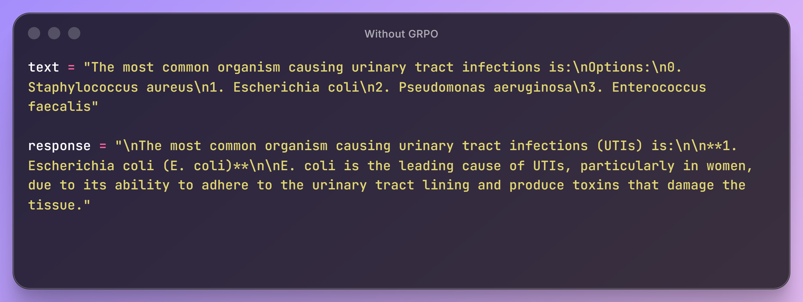
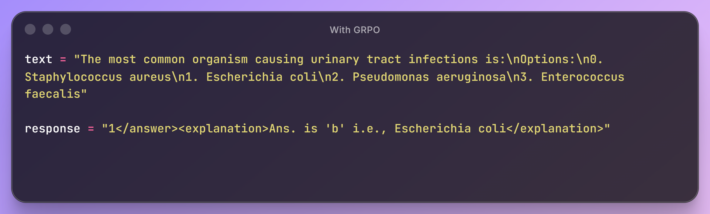
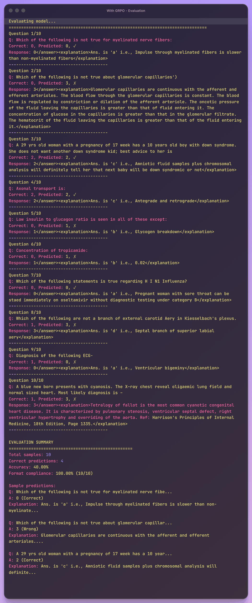

# Medical MCQ Answering with SFT + GRPO

Fine-tuned **Qwen3-1.7B** on 182K medical entrance exam questions using a two-phase pipeline: Supervised Fine-Tuning (SFT) followed by Group Relative Policy Optimization (GRPO). Built during the [Vizuara AI Workshop](https://www.vizuara.ai/) on RL for LLMs, using [Unsloth](https://github.com/unslothai/unsloth) and [TRL](https://github.com/huggingface/trl) frameworks.

## Approach

### Phase 1: Supervised Fine-Tuning (SFT)
- Fine-tuned Qwen3-1.7B-Base with LoRA adapters (rank 32, alpha 64, ~2% trainable parameters)
- Trained on 1,000 samples for 2 epochs to teach the model the expected output format
- 4-bit quantized training via Unsloth for memory efficiency

### Phase 2: Group Relative Policy Optimization (GRPO)
- Applied GRPO reinforcement learning on top of the SFT model
- Trained for 400 steps on 40,000 examples (subset of 182K)
- Used vLLM as the generation backend for fast sampling during training

### Custom Reward Functions
The reward design is the core of the GRPO phase. Three signals shape model behavior:

| Reward Function | What It Measures | Signal |
|----------------|-----------------|--------|
| `reward_correctness` | Does predicted answer (0-3) match the correct option? | Binary 0/1 |
| `reward_format` | Does output follow `<answer>X</answer><explanation>...</explanation>` XML structure? | Binary 0/1 |
| `reward_explanation_length` | Is the explanation between 20-200 characters? (partial credit for 10+) | 0 / 0.5 / 1.0 |

### Expected Output Format
```
<answer>1</answer><explanation>Escherichia coli is the most common cause of UTIs...</explanation>
```

## Results

Evaluated on 10 samples from the MedMCQA validation set:

| Metric | Value |
|--------|-------|
| Accuracy | 40% (4/10) |
| Format Compliance | 100% (10/10) |
| Eval Set | 10 samples (MedMCQA validation) |

### Before GRPO (SFT-only output)
The model generates free-form text without structured formatting:



### After GRPO
The model consistently produces structured `<answer>` + `<explanation>` output:



### Evaluation Summary


## Technical Details

| Parameter | Value |
|-----------|-------|
| Base Model | `unsloth/Qwen3-1.7B-Base` |
| LoRA Rank | 32 |
| LoRA Alpha | 64 |
| LoRA Targets | q/k/v/o_proj, gate/up/down_proj |
| Trainable Params | 34.8M / 1.76B (1.99%) |
| SFT Learning Rate | 2e-4 |
| GRPO Learning Rate | 5e-6 |
| GRPO Batch Size | 2 (x4 gradient accumulation) |
| GRPO Generations | 2 per prompt |
| Max Sequence Length | 1024 |
| GRPO Sampling | temp=1.0, top_p=1.0, min_p=0.1 |
| Hardware | Kaggle T4/P100 GPU (single GPU) |

## Repository Structure

```
medmcqa-grpo-finetuning/
  README.md
  .gitignore
  notebooks/
    01_sft_grpo_training.ipynb    # Full training pipeline (SFT + GRPO)
    02_evaluation.ipynb           # Model evaluation with metrics
  results/
    with_grpo_example.png         # Output example after GRPO
    without_grpo_example.png      # Output example before GRPO (SFT only)
    evaluation_summary.png        # Evaluation metrics screenshot
    evaluation_results.xlsx       # Raw evaluation data
  archive/
    failed_attempt_qwen3_4b.ipynb # Earlier attempt with Qwen3-4B (superseded)
    math_sft_qwen2.5.ipynb        # SFT experiment on math datasets
```

## Dataset

**Source:** [openlifescienceai/medmcqa](https://huggingface.co/datasets/openlifescienceai/medmcqa) on Hugging Face

- 182,822 medical entrance exam questions (train split)
- 4 options per question (A/B/C/D mapped to 0/1/2/3)
- Covers pharmacology, anatomy, pathology, biochemistry, and other medical subjects
- Each question includes the correct answer index and (optionally) an explanation

## Acknowledgments

- **[Vizuara AI Workshop](https://www.vizuara.ai/)** -- Methodology, curriculum, and initial code structure for the SFT + GRPO pipeline
- **[Unsloth](https://github.com/unslothai/unsloth)** -- Memory-efficient fine-tuning with LoRA and vLLM integration
- **[TRL (Transformer Reinforcement Learning)](https://github.com/huggingface/trl)** -- GRPOTrainer implementation
- **[MedMCQA Dataset](https://medmcqa.github.io/)** -- Large-scale medical MCQ dataset from Indian medical entrance exams

## Limitations

- **Small evaluation set:** 10-sample eval is not statistically robust; a full validation run (4,183 samples) would give more reliable accuracy numbers
- **Modest accuracy:** 40% on a 4-choice MCQ (25% is random) shows the model learned something, but is far from production-grade medical QA
- **No model weights:** Model checkpoints are too large for GitHub; only code and results are included
- **Single-GPU constraints:** GRPO with only 2 generations per prompt (vs. typical 4-8) due to Kaggle GPU memory limits
